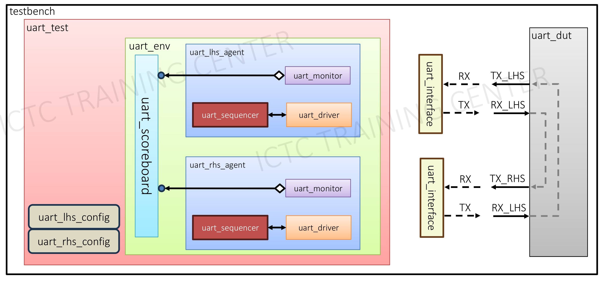

# Develop and validate UART VIP

## Introduce
My name is Nguyen Van Huy, and I am a course participant at ICTC (IC Training Center Vietnam). This article presents my work on develop and validate UART VIP, a project I have completed as part of my course at ICTC. The goal of this article is to show the knowledge and skills I have gained through my studies at ICTC and to demonstrate my abilities to potential employers in the field of Design Verification.

UART is an asynchronous communication protocol using a start bit to begin transmission, a data frame for actual data (5-9 bits), an optional parity bit for error checking, and stop bits to signal the end. Baud rate determines data transfer speed. Common baud rates include 4800, 9600, 19200, 57600 and 115200 bps.

## Summary of Input Documents for UART

In this section, I have summarized the key points from the "UART Specification" provided by the center.
For further details, please refer to the full documents linked below:
- [UART Slide Presentation](https://github.com/huynv1212/Uart_Verification/blob/b7d4db5c69995b3bbfcb4ec77676a7f98ebc095e/14.%20Project%202.%20Develop%20and%20validate%20UART%20VIP.pdf).
- [UART Specification Document](https://github.com/huynv1212/Uart_Verification/blob/dbb30989dad604e863c3684781a27175cdc2aa41/UART%20Protocol%20summary.pdf).

Summary uart specification:
- UART TX is high when idle
- Start Bit: Signals the beginning of data transmission, usually a single low bit.
- Data Bits: Typically 5 to 9 bits representing the actual data.
- Parity Bit (optional): Error-checking bit to detect single-bit errors.
- Stop Bit(s): Indicates the end of data transmission, typically one or two high bits.
- Baud Rate: Defines the rate of data transmission in bits per second (bps) and needs to match on
both transmitting and receiving UART. Common baud rate: 4800, 9600, 19200, 57600 and
115200

## Tools and Methodology Used
Tools and Methodology Used
- Language: SystemVerilog for writing testbenches and verification components.
- Methodology: UVM for building a structured and reusable verification environment.
- EDA Tool: QuestaSim for simulation and debugging.
## Verification Structure Design
Below is a picture describing the Testbench structure to verify the VIP

Top-Level (`uart_test`)

  The outermost layer of the testbench. It contains:
- **Environment (`uart_env`)**: The main testing structure.
- **Configuration (`uart_lhs_config` and `uart_rhs_config`)**: These blocks define specific settings for the left-hand and right-hand agents. Settings include baud rate, data bits, parity, and stop bits. They ensure that both agents operate correctly within the test environment, with the goal of verifying the correctness of the UART VIP.

Environment (`uart_env`)

  The environment includes:
- **Agents**: Simulate and monitor UART behavior on both sides.
- **Scoreboard**: Verifies data correctness by comparing what is sent and received, and also checks that the baud rate is correct.

Agents (`uart_lhs_agent` and `uart_rhs_agent`)

- **`uart_lhs_agent`**: Simulates one side of the UART (left-hand side).
- **`uart_rhs_agent`**: Simulates the other side (right-hand side).

  Each agent contains:
- **Monitor**: Observes UART signals like TX and RX without interfering.
- **Driver**: Sends test data to the UART under sequencer control.
- **Sequencer**: Decides the order and type of data sent to the driver.

Scoreboard (`uart_scoreboard`)

  This component checks whether the UART is functioning correctly. It compares:
- **Data** transmitted by one agent (TX) and received by the other agent (RX).
- **Baud rate** to ensure that both agents are operating at the correct speed and that the transmission matches the configured baud rate.

Interfaces (`uart_interface`)

  These represent the physical UART connections:
- **`TX_LHS` and `RX_LHS`**: Connect to the left-hand side of the UART.
- **`TX_RHS` and `RX_RHS`**: Connect to the right-hand side.

Device Under Test (`uart_dut`)

  The UART design being verified. It connects to the testbench through the UART interfaces.

## Verification Plan Design
coming soon!
## Verification Environment Design and Develop
coming soon!
## Conclusion and Acknowledgment

